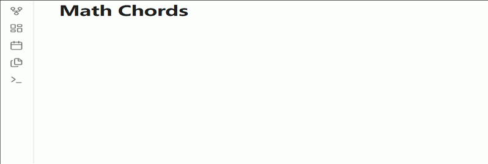

# Math Chords for Obsidian

[English](README.md)

[](manifest.json)
[](LICENSE)
[](https://github.com/ichenh/obsidian-math-chords/actions/workflows/ci.yml)

**Math Chords** 为 Obsidian 提供 **LaTeX 公式快捷键**：按 leader 键（默认 `Alt+M`），再按短序列即可插入分数、希腊字母、积分等片段，无需手打 `\frac`、`\alpha` 等命令。还支持可选的 **行内公式实时预览**、**公式内大括号跳转** 和 **行间公式环境包裹**。

内置默认快捷键参考了 [LyX](https://www.lyx.org/) 数学模式的绑定。

**当前版本：v0.2.1。** 见 [CHANGELOG](CHANGELOG.md)。

**需要 Obsidian 1.5.0+。** 以键盘操作为主，建议在桌面端使用。

> **社区插件市场说明：** Obsidian 社区插件列表里的插件简介来自 `manifest.json`，**固定为英文**（浏览页的按钮、标签等会随软件语言变化）。安装后，**设置 → Math Chords** 及命令名称会跟随 Obsidian 显示语言（含简体中文、繁体中文等）。
>
> 市场英文简介大意：**用快捷键输入 LaTeX 公式**（分数、希腊字母、积分等 100+ 片段；行内预览、行间环境包裹；设置界面支持 70+ 种语言）。



---

## 目录

- [功能](#功能)
- [安装](#安装)
- [快速开始](#快速开始)
- [快捷键参考](#快捷键参考)
- [行间公式环境包裹](#行间公式环境包裹)
- [配置](#配置)
- [设置](#设置)
- [更新快捷键](#更新快捷键)
- [项目结构](#项目结构)
- [开发](#开发)
- [AI 辅助说明](#ai-辅助说明)
- [许可证](#许可证)

---

## 功能

| 功能 | 说明 |
| :--- | :--- |
| **快捷键** | 按可配置的 leader 键，再按按键序列插入 LaTeX 片段。 |
| **光标占位符** | 命令模板中的 `$$` 标记光标（或选区）位置，例如 `\frac{$$}{}`。 |
| **自动 `$…$` 包裹** | 可选：在公式区域外插入时，自动用行内公式定界符包裹。 |
| **行内实时预览** | 光标位于 `$…$` 内时，在公式上方用 Obsidian 原生 **MathJax** 渲染预览（默认开启）。 |
| **公式内大括号跳转** | 在 `$…$` / `$$…$$` 内用可配置按键在 `{…}` 参数位之间跳转（默认 `Alt+→` / `Alt+←`；默认开启）。 |
| **行间公式环境** | 通过模糊搜索选择 `\begin{…}…\end{…}` 包裹块内容；必要时先插入 `$$…$$`。 |
| **内置数学命令** | 插入行内/行间公式；可选的智能切换在已有公式块内取消包裹或互相转换（见设置项 **Smart math toggle**）。 |
| **YAML + 设置界面** | 编辑 `shortcuts.yaml` 或使用设置页；修改后立即重建快捷键查找树。 |
| **界面本地化** | 11 种主流语言内置于 `main.js`（含简/繁中文）。其余 61 种 [Obsidian 官方语言](https://github.com/obsidianmd/obsidian-translations#existing-languages) 需在插件目录放置 `locales-extras.json`（社区插件安装不会自动下载该文件）。 |
| **非破坏性合并** | 加载时合并缺失的默认快捷键，不会覆盖你的自定义绑定。 |

---

## 安装

### 社区插件（推荐）

在 **设置 → 社区插件 → 浏览** 中搜索 **Math Chords** 并安装。

Obsidian 安装器只会从 GitHub Release 下载 **`main.js`**、**`manifest.json`**、**`styles.css`** 这三个文件，不会下载 Release 中的其他附件。这对插件全部功能已足够。**11 种内置语言**（见下方 [设置](#设置)）的设置界面可立即显示对应翻译；若 Obsidian 界面语言不在其中，Math Chords 设置页会显示英文，直到你自行添加 `locales-extras.json`（见下文）。

### 从 Release 手动安装

从 [Releases](https://github.com/ichenh/obsidian-math-chords/releases) 下载 **`main.js`**、**`manifest.json`**、**`styles.css`**、**`locales-extras.json`** 到库内的 `.obsidian/plugins/math-chords/`（若无此目录请先创建）。`locales-extras.json` 须与当前插件版本 **同一 Release 标签**。如需默认快捷键文件，可从仓库复制 **`shortcuts.yaml`**。

### 可选：额外界面语言（`locales-extras.json`）

若 Obsidian 显示语言 **不在** 上述 11 种内置语言之列，请自行安装或更新该文件：

1. 打开 [Releases](https://github.com/ichenh/obsidian-math-chords/releases)，下载与已安装插件版本一致的 **`locales-extras.json`**（版本可在 **设置 → 社区插件** 或插件目录下的 `manifest.json` 中查看）。
2. 放到 **`.obsidian/plugins/math-chords/locales-extras.json`**（与 `main.js` 同级，不要放在笔记目录里）。
3. 重载 Obsidian，或关闭再开启本插件。

没有该文件时插件功能正常，只是 **Math Chords 设置界面** 为英文。添加后，下次加载时设置页会跟随 Obsidian 语言显示（JSON 中包含的 61 种语言均支持）。

通过社区插件更新版本时，若你依赖非内置语言，需 **重复上述步骤** —— 更新只会替换 `main.js` / `manifest.json` / `styles.css`，不会更新 `locales-extras.json`。

### 从源码构建

```bash
git clone https://github.com/ichenh/obsidian-math-chords.git
cd obsidian-math-chords
npm install
npm run build
```

将 `main.js`、`manifest.json`、`styles.css`、`locales-extras.json` 和 `shortcuts.yaml` 复制到 `.obsidian/plugins/math-chords/`。

---

## 快速开始

1. 在 Markdown 笔记中定位光标。
2. 按下 **leader 键**（默认 `Alt+M`，可在设置中修改）——可在设置中开启 which-key 提示面板。
3. 继续按快捷键，例如 **`F`** → `\frac{}{}`，光标落在分子处。
4. 希腊字母：**`G` `A`** → `\alpha`（leader 之后的按键）。
5. 行间公式：**`D`** → `$$\n\n$$`。
6. 智能切换（默认开启）：在公式块内，行内/行间命令会取消包裹或互相转换，而非重复插入；可在设置 **Smart math toggle** 中关闭。
7. 可选：在 **设置 → 快捷键** 中为 **Insert inline math**、**Insert display math**、**Wrap display math with environment** 绑定热键（插件不注册默认热键）。
8. 按 leader 之后的 **`Shift+E`**（默认），或运行命令 **Wrap display math with environment** 选择环境；若光标不在 `$$…$$` 内，会先插入行间公式块。

> **说明：** 下文快捷键表只列出 **leader 之后** 的按键。默认 leader 为 `Alt+M`。

---

## 快捷键参考

### 结构与行间公式

| 按键 | 插入 | 说明 |
| :--- | :--- | :--- |
| `F` | `\frac{}{}` | 分数 |
| `S` | `\sqrt{}` | 平方根 |
| `Shift+R` | `\sqrt[]{}` | n 次根 |
| `^` | `^{}` | 上标 |
| `Shift+_` | `_{}` | 下标 |
| `D` | `$$…$$` | 行间公式块 |

### 运算符与符号

| 按键 | 插入 | 说明 |
| :--- | :--- | :--- |
| `U` | `\sum` | 求和 |
| `I` | `\int` | 积分 |
| `Shift+I` | `\int_{}^{}` | 带上下限积分 |
| `Y` | `\oint` | 环路积分 |
| `P` | `\partial` | 偏导 |
| `Shift+P` | `\prod_{}^{}` | 连乘 |
| `L` | `\lim_{}` | 极限 |
| `8` | `\infty` | 无穷 |
| `'` | `'` | 撇号 |
| `+` | `\pm` | 正负号 |
| `= \|` | `\neq` | 不等号 |

### 重音与修饰

| 按键 | 插入 | 说明 |
| :--- | :--- | :--- |
| `"` | `\ddot{}` | 二阶导点 |
| `H` | `\hat{}` | 尖帽 |
| `\` | `\grave{}` | 重音符 |
| `/` | `\acute{}` | 锐音符 |
| `&` | `\tilde{}` | 波浪 |
| `-` | `\bar{}` | 上横线 |
| `.` | `\dot{}` | 一阶导点 |
| `Shift+V` | `\breve{}` | 短音 |
| `Shift+U` | `\check{}` | 抑扬 |
| `V` | `\vec{}` | 向量箭头 |
| `_` | `\underline{}` | 下划线 |
| `B` | `\overline{}` | 上划线 |
| `A W` | `\widehat{}` | 宽尖帽 |

### 定界符

| 按键 | 插入 | 说明 |
| :--- | :--- | :--- |
| `(` | `\left(\right)` | 圆括号 |
| `[` | `\left[\right]` | 方括号 |
| `{` | `\left\{\right\}` | 花括号 |
| `<` | `\left\langle\right\rangle` | 尖括号 |
| `>` | `\left)\right(` | 反圆括号 |
| `\|` | `\left\|\right\|` | 竖线 |
| `B N` | `\left\|\right\|` | 范数 |
| `B F` | `\left\lfloor\right\rfloor` | 下取整 |
| `B E` | `\left\lceil\right\rceil` | 上取整 |

### 希腊字母 — 小写（`G` + 键）

| 按键 | 插入 | 按键 | 插入 |
| :--- | :--- | :--- | :--- |
| `G A` | `\alpha` | `G N` | `\nu` |
| `G B` | `\beta` | `G O` | `\omega` |
| `G C` | `\chi` | `G P` | `\pi` |
| `G D` | `\delta` | `G Q` | `\vartheta` |
| `G E` | `\epsilon` | `G R` | `\rho` |
| `G F` | `\phi` | `G S` | `\sigma` |
| `G G` | `\gamma` | `G T` | `\tau` |
| `G H` | `\eta` | `G U` | `\upsilon` |
| `G I` | `\iota` | `G V` | `\theta` |
| `G J` | `\varphi` | `G X` | `\xi` |
| `G K` | `\kappa` | `G Y` | `\psi` |
| `G L` | `\lambda` | `G Z` | `\zeta` |
| `G M` | `\mu` | | |

### 希腊字母 — 大写与变体（`G Shift+` + 键）

| 按键 | 插入 | 按键 | 插入 |
| :--- | :--- | :--- | :--- |
| `G Shift+D` | `\Delta` | `G Shift+S` | `\Sigma` |
| `G Shift+E` | `\varepsilon` | `G Shift+T` | `\varsigma` |
| `G Shift+F` | `\Phi` | `G Shift+U` | `\Upsilon` |
| `G Shift+G` | `\Gamma` | `G Shift+V` | `\Theta` |
| `G Shift+L` | `\Lambda` | `G Shift+O` | `\Omega` |
| `G Shift+P` | `\Pi` | `G Shift+X` | `\Xi` |
| | | `G Shift+Y` | `\Psi` |

### 扩展前缀

**箭头**（`W` 前缀）：`W R` `\rightarrow`，`W L` `\leftarrow`，`W Shift+R` `\Rightarrow`，`W Shift+L` `\Leftarrow`，`W M` `\mapsto`

**运算符**（`O` 前缀）：`O T` `\times`，`O C` `\cdot`，`O D` `\div`，`O E` `\equiv`，`O L` `\leq`，`O G` `\geq`，`O A` `\approx`，`O I` `\in`，`O U` `\cup`，`O Shift+U` `\cap`，`O Shift+N` `\nabla`

**字体**（`T` 前缀）：`T B` `\mathbf{}`，`T C` `\mathcal{}`，`T R` `\mathrm{}`，`T Shift+R` `\mathbb{}`，`T T` `\text{}`

**矩阵**（`M` 前缀）：`M P` pmatrix，`M B` bmatrix，`M C` cases

完整列表见 [`shortcuts.yaml`](shortcuts.yaml)（101 条默认快捷键）。

---

## 行间公式环境包裹

在 `$$…$$` 内，或在笔记任意位置（若尚未有行间块会先自动插入）：

1. 按 leader 之后配置的快捷键（默认 **`Shift+E`**），或在命令面板运行 **Wrap display math with environment**。
2. 从模糊搜索列表中选择环境。
3. 插件会包裹**整个块内容**（不仅是选区），例如  
   `$$\alpha+\beta$$` → `$$\begin{aligned}\alpha+\beta\end{aligned}$$`

在 **设置 → Math Chords** 的 **Enable environment wrap**（启用环境包裹）中配置环境与触发按键；也可在 **设置 → 快捷键** 中为上述命令绑定热键。

默认环境：`aligned`、`matrix`、`cases`、`gathered`。

---

## 配置

### `shortcuts.yaml`

快捷键为 YAML 数组。**leader 键**在设置中全局配置，不写在每条记录里。

```yaml
- keys: "F"
  command: "\\frac{$$}{}"
  name: "Fraction"
  group: "Structures"

- keys: "G A"
  command: "\\alpha"
  name: "alpha"
  group: "Greek"
```

| 字段 | 必填 | 说明 |
| :--- | :---: | :--- |
| `keys` | 是 | leader 之后的按键序列。空格分隔；修饰键用 `+`（如 `Shift+S`、`G A`）。 |
| `command` | 是 | LaTeX 片段。`$$` 表示光标/选区位置。设置界面中写 `\frac` 即可，无需 `\\frac`（会自动规范化）。 |
| `name` | 否 | 设置表与 which-key 面板中的显示名称。 |
| `group` | 否 | 设置表中的分组标签。 |

特殊命令 `__DISPLAY_MATH__` 插入 `$$…$$` 块（`D` 使用）。

### 按键规范化

- 按键规范为小写 `修饰键+基键` 顺序：`ctrl` → `alt` → `shift` → `meta`。
- 字母默认小写，除非显式写 `Shift`（如 `Shift+A`）。

---

## 设置

打开 **设置 → Math Chords**。在有可用翻译时，设置界面会跟随 Obsidian 的显示语言。

**内置于 `main.js`**（无需额外文件；社区插件安装即可）：English、简体中文、繁體中文、日本語、한국어、Deutsch、Français、Español、Русский、Português (BR)、Italiano。

**其余 [Obsidian 官方语言](https://github.com/obsidianmd/obsidian-translations#existing-languages)**（如 Polski、Nederlands、ไทย、العربية、English (UK)、Português 等）需要在插件目录放置 **`locales-extras.json`**。社区插件安装不会下载该文件；步骤见 [可选：额外界面语言](#可选额外界面语言locales-extrasjson)。

| 设置项 | 默认值 | 说明 |
| :--- | :--- | :--- |
| Enable plugin（启用插件） | 开 | leader 快捷键总开关。 |
| Show shortcut hints（显示快捷键提示） | 开 | leader 后显示 which-key 面板。 |
| Inline math live preview（行内公式实时预览） | 开 | 在 `$…$` 上方 MathJax 预览。 |
| Brace navigation in math（公式内大括号跳转） | 开 | 在公式内 `{…}` 之间跳转；默认 `Alt+→` / `Alt+←`。 |
| Next / previous brace keys（下/上一大括号键） | `Alt+→` / `Alt+←` | 大括号跳转快捷键（启用后生效）。 |
| Leader key（Leader 键） | `Alt+M` | 快捷键前缀；YAML 中 `keys` 为 leader 之后的部分。 |
| Auto-wrap outside math（公式外自动包裹） | 开 | 非公式区域插入时自动加 `$…$`。 |
| Smart math toggle（智能公式切换） | 开 | 在已有公式块内，行内/行间命令会取消包裹或转换，而非插入新块。 |
| Enable environment wrap（启用环境包裹） | 开 | 环境选择器；必要时先插入 `$$…$$`。 |
| Environment wrap keys（环境包裹快捷键） | `Shift+E` | leader 之后触发环境选择器的按键。 |
| Math environments（数学环境） | 4 个内置 | 可编辑的环境列表。 |

**内置命令**（在 **设置 → 快捷键** 中自行绑定）：**Insert inline math**、**Insert display math**、**Wrap display math with environment**。

- `Insert inline math`：在非公式区域插入 `$…$`；开启 **Smart math toggle** 时，在行内公式内取消包裹，在行间公式内转换为行内。
- `Insert display math`：在非公式区域插入 `$$…$$`；开启 **Smart math toggle** 时，在行间公式内取消包裹，在行内公式内转换为行间。

**Shortcut management（快捷键管理）：** 搜索、添加、编辑、删除；**Reload** 重新读取 YAML；**Merge defaults** 追加缺失的内置项，不覆盖已有绑定。

---

## 更新快捷键

插件加载时（或点击 **Reload** / **Merge defaults**）：

1. 已有 YAML 条目**原样保留**（相同 `keys` → 相同绑定）。
2. 尚未出现的默认快捷键会**追加**到文件末尾。
3. 更新后的内容写回 `shortcuts.yaml`。

若要完全重置，删除 `shortcuts.yaml` 后重新加载插件（会重新生成默认文件）。

从 TypeScript 重新生成仓库默认 YAML：

```bash
npm run seed
```

---

## 项目结构

```
math-chords/                  # 插件 id；安装目录 .obsidian/plugins/math-chords/
├── src/                    # TypeScript 源码
│   ├── main.ts             # 插件入口
│   ├── leader.ts           # Leader 快捷键状态机
│   ├── braceNav.ts         # 公式内大括号跳转
│   ├── defaults.ts         # 默认快捷键目录
│   ├── config.ts           # YAML 读写与合并
│   ├── l10n/               # 内置语言包 + 按需加载 extras
│   └── …                   # 公式检测、预览、设置界面等
├── src/*.test.ts           # Vitest 单元测试
├── vitest.config.ts
├── shortcuts.yaml          # 随仓库分发的默认快捷键（101 条）
├── styles.css              # 预览与设置样式
├── manifest.json           # Obsidian 插件清单
├── esbuild.config.mjs      # 构建配置
└── scripts/seed-yaml.cjs   # 从 defaults.ts 生成 YAML
```

---

## 开发

```bash
npm install
npm run dev    # 监听模式构建
npm run build  # 类型检查 + 生产构建
npm test       # Vitest 单元测试
npm run seed   # 从 src/defaults.ts 重写 shortcuts.yaml
npm run seed:locales  # 从 scripts/locale-catalog.json 生成内置 TS 语言包与 locales-extras.json
```

模块划分与约束见 [`.cursorrules`](.cursorrules)。

欢迎提交 Pull Request，提交前请运行 `npm run build` 和 `npm test`。

### 发布

1. 更新 `manifest.json`、`package.json` 中的 `version`，并在 `versions.json` 中添加映射。
2. 更新 `CHANGELOG.md`。
3. 提交后打 tag（不要加 `v` 前缀），例如 `git tag 0.2.0 && git push origin 0.2.0`。
4. [release 工作流](.github/workflows/release.yml) 会自动构建并附上 `main.js`、`manifest.json`、`styles.css` 和 `locales-extras.json`，并为 `main.js`、`styles.css` 生成 artifact attestations。

---

## AI 辅助说明

本仓库在人工审阅下使用 **AI 辅助编程工具**（Cursor IDE 与大语言模型）进行开发与维护。

- 完整说明：[AI-ASSISTANCE.md](AI-ASSISTANCE.md)
- 贡献者若使用 AI，请在 PR 中说明，并审阅全部输出。

---

## 许可证

[MIT](LICENSE) © [CHEH Hua](https://github.com/ichenh)
